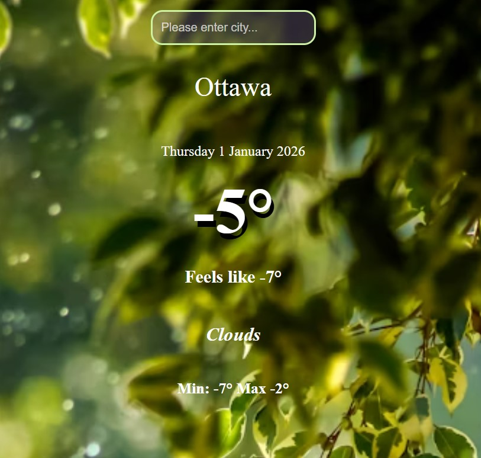

# Weather App 🌤️

Clean weather application built with vanilla JavaScript.  
The app allows users to check the current weather conditions for any city using real-time data from the OpenWeather API.

## 🔹 Features
- Search weather by city name
- Displays current temperature, weather condition, and location
- Real-time data fetched from OpenWeather API
- Responsive layout for desktop and mobile
- Clean and user-friendly interface

## 🔹 Technologies Used
- HTML5
- CSS3
- JavaScript (ES6)
- OpenWeather API

## 🔹 Live Demo
👉 https://weatherforecastproject2026.netlify.app/

## 🔹 What I Learned
- Working with external APIs
- Fetching and handling asynchronous data
- Error handling for invalid user input
- Updating the UI dynamically based on API responses

## 🔹 Future Improvements
- Add loading states
- Improve error messages
- Extend weather details (humidity, wind, feels-like temperature)

---

📍 Built as a learning project to strengthen JavaScript fundamentals and API integration skills.
